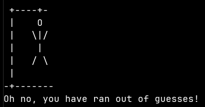

# Hangman (C++)

> Made by [@whyammehere](https://github.com/whyammehere), [@cmaccarp](https://github.com/cmaccarp), and [@n-crespo](https://github.com/n-crespo)

A primitive text-based hangman game coded in C++ and run in the command line.




## Usage

To play hangman, first clone the repo by typing the following into a terminal
(assuming you have git set up correctly):

```bash
git clone git@github.com:cmaccarp/hangman-cpp.git
```

Then `cd` into the `hangman-cpp/` directory

```bash
cd hangman-cpp/
```

### Linux

If you are using Linux or WSL, `make` comes pre-installed, so just type the
following:

```bash
make
./hangmanGame
```

### MacOS

If you are on MacOS, you need to install `make`. See
[this stack overflow thread](https://stackoverflow.com/questions/1469994/using-make-on-os-x),
make sure the command `make` works, then inside of the `hangman-cpp/` directory,
simply type the following:

```bash
make
./hangmanGame
```

### Windows

If you are on Windows, first install the chocolatey package manager with `winget
install chocolatey`. Close and reopen the terminal for it to take effect. Then
type `choco install make` to install make. Reopen the terminal again. After
navigating to wherever you cloned the hangmanGame repository, type the
following:

```bash
make
./hangmanGame
```
